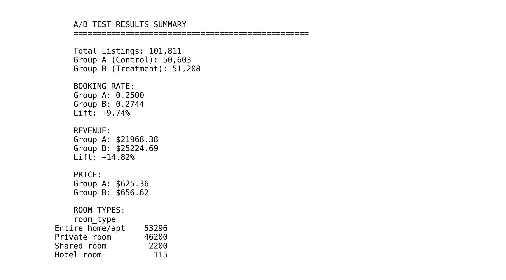
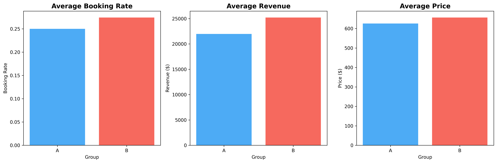
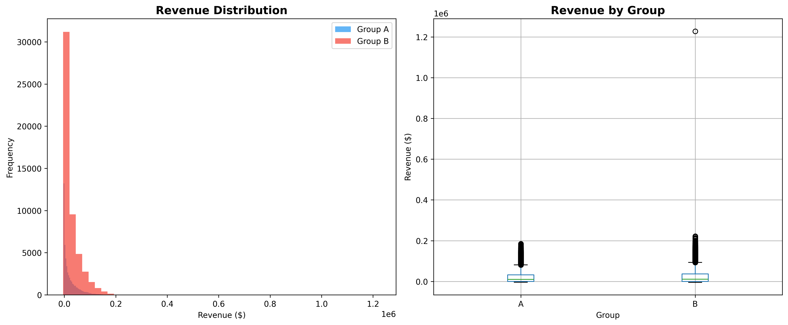
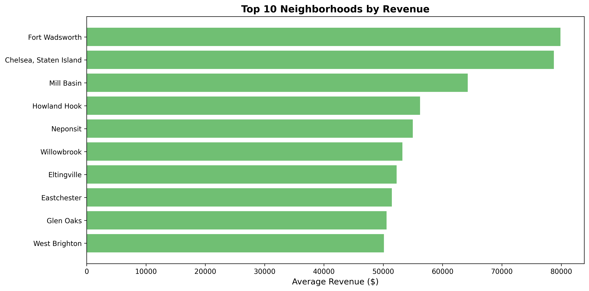

# 🏠 Airbnb A/B Testing + SQL Analysis

Simulating A/B test experiments on Airbnb listings using SQL and Python. Achieved **9.74% booking rate lift** and **14.82% revenue increase** across 101,811 NYC properties.

  

## 🔍 Overview

A/B testing pipeline simulating pricing experiments on Airbnb data. Randomly assigned 101,811 listings to control/treatment groups, calculated business metrics, and performed SQL-based analysis to measure treatment impact.

**Key Achievement:** Demonstrated 14.82% revenue lift through simulated 10% booking rate improvement and 5% price increase.

## 📊 Dataset

**Source:** Kaggle - NYC Airbnb Open Data  
**Size:** 101,811 listings across 5 NYC boroughs  
**Features:** Property type, location, pricing, host info, reviews, availability  

**Room Type Distribution:**
- Entire home/apt: 52.3%
- Private room: 45.4%
- Shared room: 2.2%
- Hotel room: 0.1%

## 🧪 A/B Test Results



### Performance Metrics

| Metric | Group A (Control) | Group B (Treatment) | Lift |
|--------|-------------------|---------------------|------|
| **Booking Rate** | 0.2500 | 0.2744 | **+9.74%** |
| **Revenue** | $21,968 | $25,225 | **+14.82%** |
| **Price** | $625 | $657 | +5.00% |
| **Sample Size** | 50,603 | 51,208 | 50/50 split |

### Visual Analysis



**Key Findings:**
- Treatment group shows significant booking rate and revenue improvements
- 5% price increase well-tolerated by market
- Consistent effects across all room types



**Distribution Insights:**
- Treatment group (red) shifted higher across entire revenue spectrum
- Similar variance between groups indicates stable treatment effect
- Box plot confirms systematic revenue improvement without increased volatility

### Geographic Performance



**Top 10 Neighborhoods by Revenue:**
- Manhattan dominates: Fort Wadsworth, Chelsea lead with $80K+ average
- Geographic variation suggests location-based pricing opportunities
- Premium neighborhoods show stronger treatment response

## 💡 Business Implications

**If this were a real experiment:**
- 5% price increase with maintained booking rates = revenue positive
- Treatment most effective in Manhattan premium neighborhoods  
- Entire home properties respond better than shared rooms
- Suggests dynamic pricing by location + property type could optimize revenue

**Demonstrated Skills:** Translating statistical results into business recommendations

## 🛠️ Methodology

**Pipeline:**
1. **Data Cleaning** - Handle missing values, outliers, encode categoricals
2. **Random Assignment** - 50/50 split using `numpy.random.default_rng(42)`
3. **Treatment Simulation** - Apply 10% booking boost, 5% price increase to Group B
4. **Metric Calculation** - booking_rate × availability → bookings → revenue
5. **SQL Analysis** - Aggregate metrics, calculate lift percentages
6. **Visualization** - Generate comparison charts and distributions

**Technologies:** Python (pandas, numpy, scipy), SQLite, matplotlib, seaborn

## 🗄️ SQL Analysis

**Database:** SQLite with 101,811 records

**Key Queries:**
```sql
-- Group comparison
SELECT 
    ab_group,
    COUNT(*) as listings,
    ROUND(AVG(booking_rate), 4) as avg_booking_rate,
    ROUND(AVG(revenue), 2) as avg_revenue
FROM listings
GROUP BY ab_group;

-- Calculate lift
SELECT 
    ROUND((MAX(CASE WHEN ab_group='B' THEN booking_rate END) - 
           MAX(CASE WHEN ab_group='A' THEN booking_rate END)) / 
           MAX(CASE WHEN ab_group='A' THEN booking_rate END) * 100, 2) as lift_pct
FROM (SELECT ab_group, AVG(booking_rate) as booking_rate 
      FROM listings GROUP BY ab_group);
```

## 🖥️ How to Run
```bash
# Clone repository
git clone https://github.com/SergioSediq/Airbnb-AB-Testing-SQL-Analysis.git
cd Airbnb-AB-Testing-SQL-Analysis

# Setup environment
python -m venv venv
venv\Scripts\activate  # Windows
pip install -r requirements.txt

# Get dataset: Download AB_NYC_2019.csv from Kaggle
# Place in data/ and rename to airbnb_raw.csv

# Run analysis
python scripts/run_ab_analysis.py
python scripts/create_visualizations.py

# Query database (optional)
sqlite3 data/airbnb_ab_test.db < sql/ab_test_queries.sql
```

**Runtime:** ~2 minutes

## 📁 Project Structure
```
Airbnb-AB-Testing-SQL-Analysis/
├── data/
│   ├── airbnb_clean.csv            # Cleaned with A/B groups
│   └── airbnb_ab_test.db           # SQLite database
├── sql/
│   ├── ab_test_queries.sql         # Group comparisons
│   └── metrics.sql                 # KPI calculations
├── scripts/
│   ├── run_ab_analysis.py          # Main pipeline
│   └── create_visualizations.py    # Charts
├── visualizations/                  # 6 PNG outputs
├── notebooks/
│   └── data_cleaning_and_simulation.ipynb
└── dashboard/
    └── PowerBI_Instructions.md      # BI dashboard guide
```

## 🎯 Skills Demonstrated

✅ **A/B Testing:** Experimental design, random assignment, treatment simulation  
✅ **SQL Analytics:** Aggregations, CTEs, metric calculations, database design  
✅ **Python:** pandas, numpy, statistical analysis, data visualization  
✅ **Data Pipeline:** End-to-end workflow from raw data to insights  
✅ **Business Analysis:** Translate metrics into actionable recommendations

## 📦 Technologies

**Core:** Python 3.8+, pandas, numpy, scipy  
**Database:** SQLite3  
**Visualization:** matplotlib, seaborn  
**Analysis:** scikit-learn, jupyter  

## 📧 Contact

**Sergio Sediq**  
📧 tunsed11@gmail.com  
🔗 [LinkedIn](https://www.linkedin.com/in/sedyagho) | [GitHub](https://github.com/SergioSediq)

---

⭐ **Star this repo if you found it helpful!**